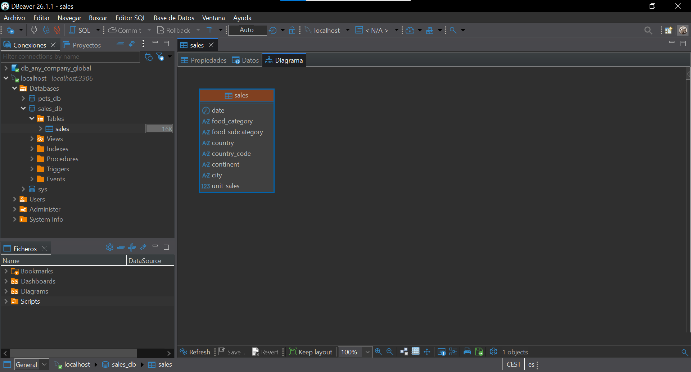
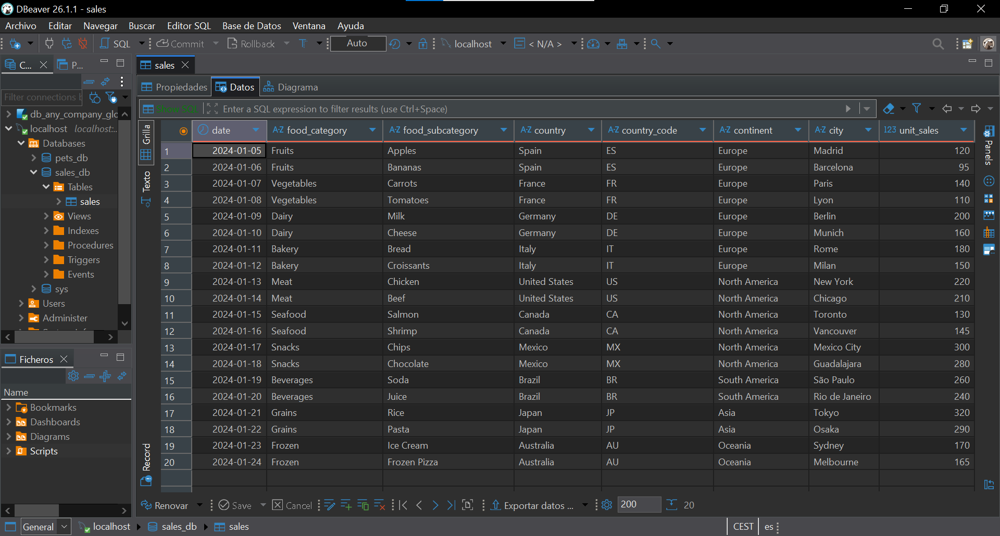
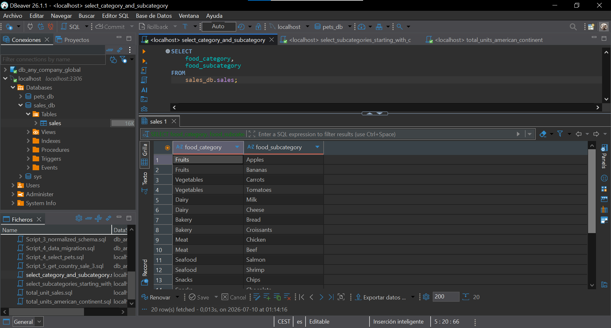
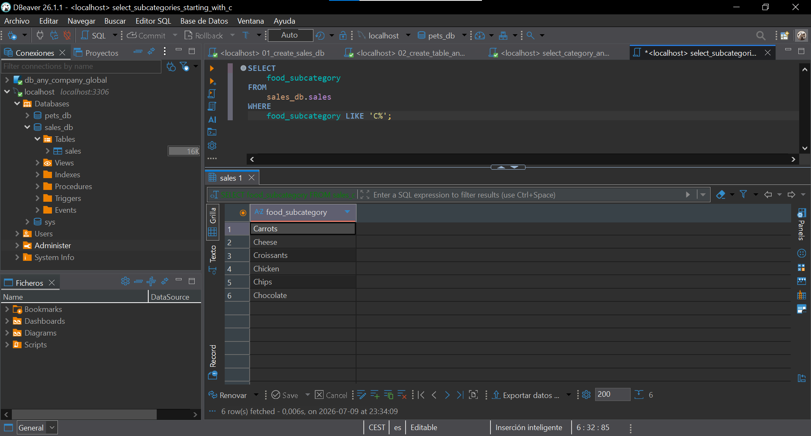
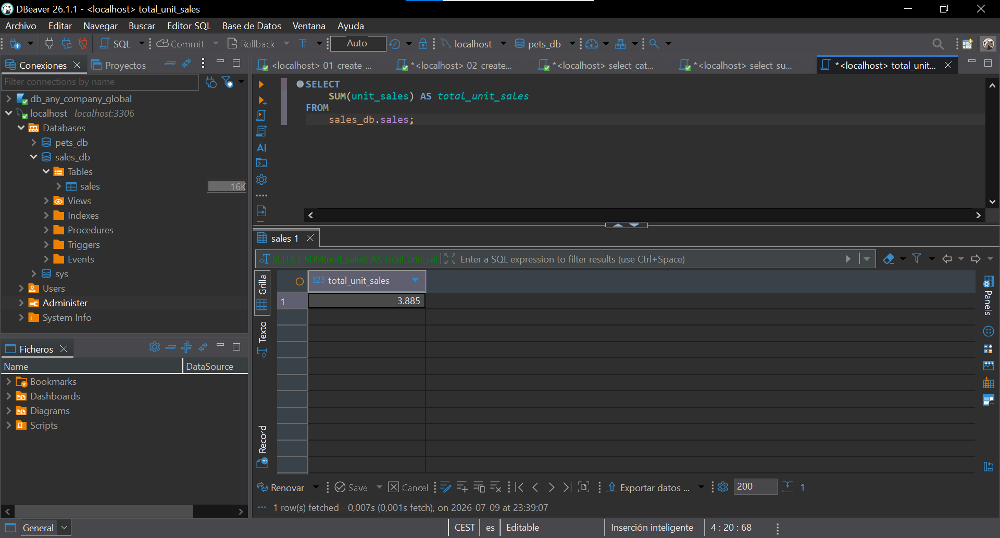
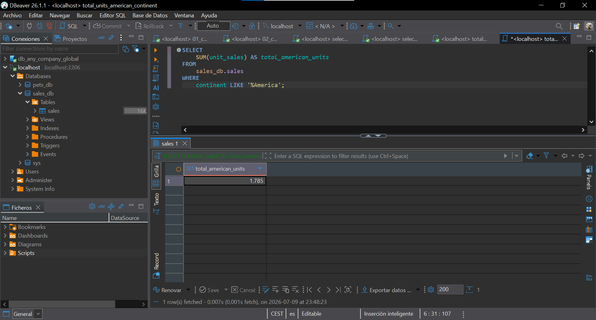

# 📊 SQL Sales – Análisis de ventas en MySQL con Docker

> Ejercicio de creación de una base de datos MySQL en Docker, con scripts SQL para consultar y agregar datos de ventas de la tabla `sales`.

---

## 📑 Índice

- [Descripción](#-descripción)
- [Pasos realizados](#-pasos-realizados)
- [Scripts SQL](#-scripts-sql)
- [Estructura del repositorio](#-estructura-del-repositorio)
- [Capturas](#-capturas)
- [Cómo reproducir el proyecto](#-cómo-reproducir-el-proyecto)
- [Tecnologías](#️-tecnologías)
- [Recursos](#-recursos)
- [Autora](#-autora)

---

## 📋 Descripción

El objetivo de este proyecto es aprender a trabajar con una base de datos MySQL alojada en un contenedor Docker, escribiendo consultas SQL que respondan preguntas concretas sobre un dataset de ventas.

Los requisitos principales son:

1. **Crear una base de datos MySQL en Docker.**
2. **Crear la tabla `sales`** con el script proporcionado por el profesor.
3. **Escribir un script** para obtener todos los datos de `food_category` y `food_subcategory`.
4. **Escribir un script** para obtener solo las subcategorías que empiezan por la letra "C".
5. **Escribir un script** para obtener la cantidad total de unidades vendidas.
6. **Escribir un script** para obtener las unidades totales del continente americano.

---

## 📋 Pasos realizados

1. **Base de datos MySQL en Docker.** Se reutiliza el contenedor `test-mysql` (imagen `mysql:8.0-debian`), creado en un [ejercicio anterior de Docker](https://github.com/Jennydev-25/docker-image-and-container), y se crea dentro una nueva base de datos independiente.

2. **Creación de la tabla y carga de datos**, con el script proporcionado (20 registros de ventas de distintos países y continentes).

3. **Escritura y verificación de las 4 consultas SQL**, ejecutadas y comprobadas una a una en DBeaver.

---

## 🧱 Scripts SQL

### Configuración de la base de datos ([`sql/setup/`](sql/setup/))

**01_create_sales_db.sql** — Creación de la base de datos:

```sql
CREATE DATABASE sales_db;
```

**02_create_table_and_insert_data.sql** — Creación de la tabla y carga de los 20 registros:

```sql
CREATE TABLE sales_db.sales (
    date DATE,
    food_category VARCHAR(50),
    food_subcategory VARCHAR(50),
    country VARCHAR(50),
    country_code CHAR(2),
    continent VARCHAR(20),
    city VARCHAR(50),
    unit_sales INT
);

INSERT INTO sales_db.sales (
    date, food_category, food_subcategory, country, country_code, continent, city, unit_sales
) VALUES
('2024-01-05', 'Fruits', 'Apples', 'Spain', 'ES', 'Europe', 'Madrid', 120),
('2024-01-06', 'Fruits', 'Bananas', 'Spain', 'ES', 'Europe', 'Barcelona', 95),
('2024-01-07', 'Vegetables', 'Carrots', 'France', 'FR', 'Europe', 'Paris', 140),
('2024-01-08', 'Vegetables', 'Tomatoes', 'France', 'FR', 'Europe', 'Lyon', 110),
('2024-01-09', 'Dairy', 'Milk', 'Germany', 'DE', 'Europe', 'Berlin', 200),
('2024-01-10', 'Dairy', 'Cheese', 'Germany', 'DE', 'Europe', 'Munich', 160),
('2024-01-11', 'Bakery', 'Bread', 'Italy', 'IT', 'Europe', 'Rome', 180),
('2024-01-12', 'Bakery', 'Croissants', 'Italy', 'IT', 'Europe', 'Milan', 150),
('2024-01-13', 'Meat', 'Chicken', 'United States', 'US', 'North America', 'New York', 220),
('2024-01-14', 'Meat', 'Beef', 'United States', 'US', 'North America', 'Chicago', 210),
('2024-01-15', 'Seafood', 'Salmon', 'Canada', 'CA', 'North America', 'Toronto', 130),
('2024-01-16', 'Seafood', 'Shrimp', 'Canada', 'CA', 'North America', 'Vancouver', 145),
('2024-01-17', 'Snacks', 'Chips', 'Mexico', 'MX', 'North America', 'Mexico City', 300),
('2024-01-18', 'Snacks', 'Chocolate', 'Mexico', 'MX', 'North America', 'Guadalajara', 280),
('2024-01-19', 'Beverages', 'Soda', 'Brazil', 'BR', 'South America', 'São Paulo', 260),
('2024-01-20', 'Beverages', 'Juice', 'Brazil', 'BR', 'South America', 'Rio de Janeiro', 240),
('2024-01-21', 'Grains', 'Rice', 'Japan', 'JP', 'Asia', 'Tokyo', 320),
('2024-01-22', 'Grains', 'Pasta', 'Japan', 'JP', 'Asia', 'Osaka', 290),
('2024-01-23', 'Frozen', 'Ice Cream', 'Australia', 'AU', 'Oceania', 'Sydney', 170),
('2024-01-24', 'Frozen', 'Frozen Pizza', 'Australia', 'AU', 'Oceania', 'Melbourne', 165);
```

### Scripts para las consultas ([`sql/queries/`](sql/queries/))

**select_category_and_subcategory.sql** — Todos los datos de categoría y subcategoría:

```sql
SELECT food_category, food_subcategory FROM sales_db.sales;
```

**select_subcategories_starting_with_c.sql** — Subcategorías que empiezan por "C":

```sql
SELECT food_subcategory FROM sales_db.sales WHERE food_subcategory LIKE 'C%';
```

**total_unit_sales.sql** — Cantidad total de unidades vendidas:

```sql
SELECT SUM(unit_sales) AS total_unit_sales FROM sales_db.sales;
```

**total_units_american_continent.sql** — Unidades totales del continente americano (Norte + Sur):

```sql
SELECT SUM(unit_sales) AS total_american_units FROM sales_db.sales WHERE continent LIKE '%America';
```

---

## 📁 Estructura del repositorio

```text
sql-sales/
├── sql/
│   ├── setup/
│   │   ├── 01_create_sales_db.sql
│   │   └── 02_create_table_and_insert_data.sql
│   └── queries/
│       ├── select_category_and_subcategory.sql
│       ├── select_subcategories_starting_with_c.sql
│       ├── total_unit_sales.sql
│       └── total_units_american_continent.sql
├── images/
│   ├── sales-table-diagram.png
│   ├── sales-table-data.png
│   ├── select-category-and-subcategory-result.png
│   ├── select-subcategories-starting-with-c-result.png
│   ├── total-unit-sales-result.png
│   └── total-units-american-continent-result.png
├── README.md
└── .gitignore
```

---

## 📸 Capturas

### Estructura de la tabla `sales`

Diagrama generado por DBeaver mostrando las 8 columnas de la tabla y sus tipos de dato.



### Datos cargados

Las 20 filas insertadas en la tabla `sales`, verificando que la carga de datos se realizó correctamente.



### Resultados de las consultas

Resultados de ejecutar cada consulta en DBeaver, verificando que los valores obtenidos son correctos.

#### Categoría y subcategoría (20 filas)



#### Subcategorías que empiezan por "C" (6 filas)



#### Total de unidades vendidas (3885)



#### Total de unidades en el continente americano (1785)



---

## 🚀 Cómo reproducir el proyecto

### Requisitos previos

- **[Docker Desktop](https://www.docker.com/products/docker-desktop/)** instalado y en ejecución
- **[DBeaver](https://dbeaver.io/download/)** instalado
- **[Git](https://git-scm.com/downloads)** para clonar el repositorio

### Pasos

1. **Clonar el repositorio:**

```bash
   git clone https://github.com/Jennydev-25/sql-sales.git
   cd sql-sales
```

2. **Arrancar un contenedor MySQL** (si no tienes uno ya corriendo). Sustituye `*******` por la contraseña que quieras usar:

```bash
   docker pull mysql:8.0-debian
   docker run --name test-mysql -p 3306:3306 -e MYSQL_ROOT_PASSWORD=******* -d mysql:8.0-debian
```

3. **Conectar DBeaver al contenedor:** `Database` → `New Database Connection` → **MySQL** → host `localhost`, puerto `3306`, usuario `root`, contraseña la que hayas elegido en el paso anterior.
4. **Ejecutar los scripts de configuración**, en orden, desde [`sql/setup/`](sql/setup/):
   | Orden | Script | Qué hace |
   | :---: | ---------------------------------------- | -------------------------------------------- |
   | 1 | `01_create_sales_db.sql` | Crea la base de datos `sales_db` |
   | 2 | `02_create_table_and_insert_data.sql` | Crea la tabla `sales` e inserta 20 filas |
5. **Ejecutar las consultas** desde [`sql/queries/`](sql/queries/), en el orden que prefieras (son independientes entre sí):
   | Script | Qué responde |
   | -------------------------------------------- | --------------------------------------------- |
   | `select_category_and_subcategory.sql` | Todas las categorías y subcategorías |
   | `select_subcategories_starting_with_c.sql` | Subcategorías que empiezan por "C" |
   | `total_unit_sales.sql` | Total de unidades vendidas |
   | `total_units_american_continent.sql` | Total de unidades en América (Norte + Sur) |

---

## 🛠️ Tecnologías

- **[Docker](https://www.docker.com/)** / **[Docker Desktop](https://www.docker.com/products/docker-desktop/)** — Contenedor donde corre MySQL
- **[MySQL 8.0](https://hub.docker.com/_/mysql)** — Motor de base de datos
- **[DBeaver](https://dbeaver.io/)** — Cliente de base de datos usado para crear `sales_db`, la tabla `sales` y ejecutar las consultas
- **[Visual Studio Code](https://code.visualstudio.com/)** — Editor usado para redactar la documentación y gestionar el proyecto
- **[Markdown](https://www.markdownguide.org/)** — Lenguaje de marcado para el README
- **[Git](https://git-scm.com/)** / **[GitHub](https://github.com/)** — Control de versiones y alojamiento del proyecto

---

## 📚 Recursos

- **[W3Schools SQL Tutorial](https://www.w3schools.com/sql/)** — Referencia y ejemplos de sintaxis SQL (recurso indicado en el enunciado del ejercicio)
- **[MySQL 8.0 Reference Manual](https://dev.mysql.com/doc/refman/8.0/en/)** — Documentación oficial de MySQL para consultar la sintaxis de las cláusulas SQL
- **[Docker Docs — Get started](https://docs.docker.com/get-started/)** — Guía oficial de Docker para la creación y gestión de contenedores

---

## 👩‍💻 Autora

**[Jenny Sánchez Requejo](https://github.com/Jennydev-25)**
